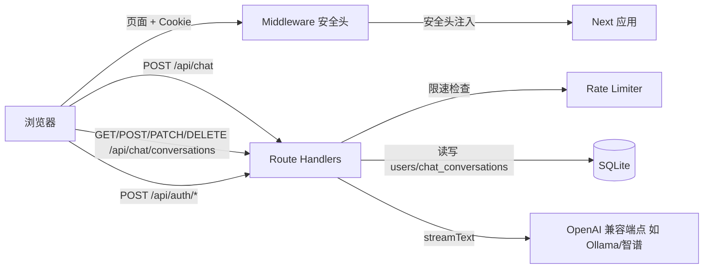

# 架构与方案（与实现对齐）

## 技术栈

- **Next.js 15.2.8**（App Router。15.2.x 在 [安全更新](https://nextjs.org/blog/security-update-2025-12-11) 建议版本线内，含 CVE-2025-55184/55183 等修复，以实际 `package-lock.json` 为准）。
- **React 19**、**TypeScript**、**Tailwind CSS v4**。
- **Vercel AI SDK 6**（`streamText`、`convertToModelMessages`、`@ai-sdk/react` 的 `useChat`、`@ai-sdk/openai` 的 `createOpenAI`）；参考 [AI SDK 文档](https://sdk.vercel.ai/docs) 中 [streamText](https://ai-sdk.dev/docs/reference/ai-sdk-core/stream-text)。
- **SQLite**（`better-sqlite3`）存储用户与密码哈希；**jose** 签发/校验 **JWT**；**bcryptjs** 哈希密码；**Zod 4** 校验请求体。

## 逻辑结构

## 重要路径

- **会话**：`itip_session` Cookie（HttpOnly）；`lib/auth/session.ts`。
- **对话**：`app/api/chat/route.ts` 内 `getSession()` 失败则 401；成功则 `streamText`：`system` 为 `CALLIGRAPHY_SYSTEM`，`messages` 为 **`CALLIGRAPHY_FEW_SHOT_MESSAGES`（few-shot）** 与前段经 `convertToModelMessages` 后的内容拼接，再 `toUIMessageStreamResponse()`。
- **前端对话**：`components/CalligraphyChat.tsx` 使用 `DefaultChatTransport({ api: "/api/chat", credentials: "include" })` 与 `useChat`（见 [AI SDK UI 与流](https://sdk.vercel.ai/docs/ai-sdk-ui/stream-protocol)）。
- **多会话管理**：
  - 数据层：`lib/chat-store.ts` 提供 `listChatConversations`、`createChatConversation`、`getChatConversation`、`saveChatConversationMessages`、`renameChatConversation`、`pinChatConversation`、`deleteChatConversation`
  - API 层：`/api/chat/conversations/route.ts`（GET/POST 列表与创建），`/api/chat/conversations/[id]/route.ts`（PATCH/DELETE 重命名/置顶/删除）
  - 页面层：`app/chat/page.tsx` 根据 `?c=` 参数路由会话，自动创建首个会话
  - 组件层：`components/ChatShell.tsx` 侧边栏显示会话列表，支持搜索、置顶、重命名、删除交互；桌面端自动展开、移动端折叠叠加显示

## 安全层

- **Middleware**（`middleware.ts`）：全局注入安全头（CSP、X-Frame-Options、X-Content-Type-Options、Referrer-Policy、Permissions-Policy）。
- **速率限制**（`lib/rate-limit.ts`）：内存简单限速器。登录每 IP 10次/分钟 + 每邮箱 5次/5分钟；注册每 IP 5次/10分钟。返回 429 + `Retry-After` 头。
- **鉴权**：Route Handler 内校验会话 Cookie，符合 [App Router 认证建议](https://nextjs.org/docs/app/guides/authentication)。

## SEO 与 PWA

- `robots.ts`：禁止 `/api/*` 与 `/chat?*` 被索引。
- `sitemap.ts`：首页、登录、注册页自动生成 sitemap。
- `layout.tsx`：Open Graph / Twitter Card / 关键词等元数据，`manifest` 指向 PWA。
- `public/manifest.json` + `public/icons/`：PWA 安装支持，含 192px/512px SVG 图标。

## 用户体验层

- `loading.tsx`（根路由 + chat 子路由）：悬停加载动画与骨架屏。
- `error.tsx`：全局错误边界含重试 + 返回首页。
- `not-found.tsx`：自定义 404 页面（书法风格）。
- `page.tsx`（首页）：跳过导航链接（Skip-to-content）。

## 可访问性

- 表单：`useId` 生成唯一 ID、`role="alert"` 错误提示、`aria-describedby` 关联。
- 导航：`role="navigation"`、`role="banner"`、`role="main"` landmark。
- 侧边栏：`aria-current="page"`、`aria-expanded`、`aria-haspopup`、`role="menu"`/`role="menuitem"`。
- 图标：`aria-hidden="true"` 装饰性 SVG。

## 流式分词（中文）

- `experimental_transform: smoothStream({ chunking: new Intl.Segmenter("zh-Hans", { granularity: "word" }) })` 以改善中文分块展示（与 AI SDK `smoothStream` 一致，见 `streamText` 相关文档中的 transform 说明）。

## 文档参考来源说明

- 本仓库在实现时以 **Next.js 官方文档** 与 **Vercel AI SDK 官方文档** 为基准；**Context7 在本机 Cursor 中未作为 MCP 启用**，未使用 Context7 拉取文档。
- 版本与 CVE 以 **联网检索** 与 `npm` 实际解析结果为准，升级时请复查 [Next.js 博客](https://nextjs.org/blog) 与 [npm advisory](https://github.com/advisories)。
