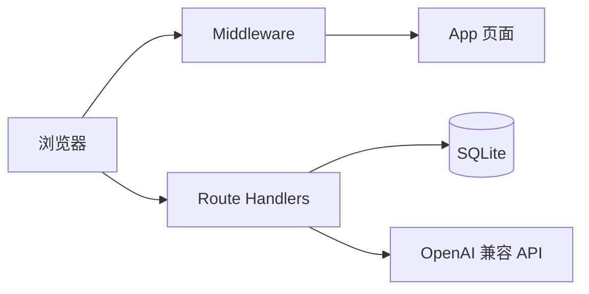
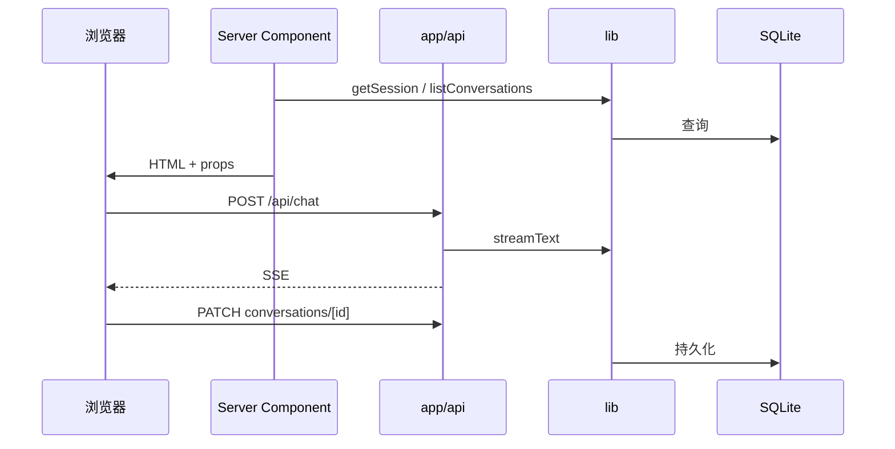

# 架构说明

iTip 全栈应用位于 `web/`，本文档与源码对齐。

## 目录

- [技术栈](#技术栈)
- [系统概览](#系统概览)
- [前后端边界](#前后端边界)
- [目录结构](#目录结构)
- [数据模型](#数据模型)
- [认证与会话](#认证与会话)
- [对话流程](#对话流程)
- [API 参考](#api-参考)
- [前端组件](#前端组件)
- [安全](#安全)
- [SEO 与 PWA](#seo-与-pwa)

## 技术栈

| 类别 | 技术 |
|------|------|
| 框架 | Next.js **15.2.8+**（App Router、`standalone`） |
| UI | React **19**、Tailwind **v4** |
| AI | Vercel AI SDK **6** |
| 数据 | SQLite（`better-sqlite3`），默认 `web/data/itip.db` |
| 鉴权 | JWT（`jose`）、bcrypt；Cookie `itip_session` |
| 校验 | Zod **4** |

版本见 `web/package-lock.json`；安全公告见 [Next.js 博客](https://nextjs.org/blog/security-update-2025-12-11)。

## 系统概览



- 受保护 API 在 Handler 内 `getSession()`，失败返回 401
- Middleware 仅注入安全头，不做登录拦截
- 对话经 AI SDK 以 UI Message Stream 流式返回

## 前后端边界

仓库无独立 `frontend/` / `backend/` 目录。`web/` 开发、生产均单进程对外（`npm run dev` / `standalone`）。

| 侧 | 路径 | 环境 | 职责 |
|----|------|------|------|
| 前端 | `components/`、`public/`、`app/page.tsx` 等 | 浏览器 | UI、交互、`fetch /api/*` |
| 后端 | `app/api/`、`lib/` | Node | 鉴权、SQLite、LLM、限速 |
| 协作 | `app/chat/` 等 Server Component | Node → 浏览器 | 服务端取数，客户端渲染 |
| 边界 | `middleware.ts` | Edge / Node | 安全响应头 |

**`app/` 双轨**：`app/chat/page.tsx` 响应 `/chat`（HTML）；`app/api/chat/route.ts` 响应 `/api/chat`（JSON / SSE）。属 [App Router 约定](https://nextjs.org/docs/app/building-your-application/routing)。

**`lib/` 规则**：仅服务端 import；客户端共享类型用 `import type`（如 `ChatConversationSummary`）。



## 目录结构

```
web/
├── app/
│   ├── api/              # 后端 API
│   ├── chat/、login/、register/、settings/
│   ├── page.tsx          # 客户端首页
│   ├── icon.jpg、apple-icon.jpg
│   └── layout.tsx、globals.css、loading/error/not-found、robots、sitemap
├── components/           # 前端（均为 use client）
├── lib/                  # 后端逻辑
│   ├── ai/、auth/、db.ts、chat-store.ts、rate-limit.ts
├── public/               # 静态资源、PWA 图标
├── middleware.ts
└── .env.example
```

## 数据模型

由 `lib/db.ts` 首次访问时初始化。

### `users`

| 列 | 说明 |
|----|------|
| `id` | TEXT PK，UUID |
| `email` | TEXT UNIQUE |
| `password_hash` | bcrypt |
| `created_at` | Unix ms |

### `chat_conversations`

| 列 | 说明 |
|----|------|
| `id` | TEXT PK |
| `user_id` | FK → `users(id)` ON DELETE CASCADE |
| `title` | 空则从首条用户消息推导 |
| `messages_json` | `UIMessage[]` JSON |
| `pinned` | 0 / 1 |
| `created_at`、`updated_at` | Unix ms |

索引：`(user_id, updated_at DESC)`。

## 认证与会话

| 项 | 值 |
|----|-----|
| Cookie | `itip_session`，JWT HS256，7 天 |
| 密钥 | `AUTH_SECRET`（≥ 16 字符） |
| 生产 | `secure: true` |

受保护页（`/chat`、`/settings`）在 Server Component 中校验，未登录 `redirect("/login")`。

## 对话流程

1. `/chat?c=<id>`：解析或创建会话，加载消息
2. 用户发消息 → `POST /api/chat`（Cookie）
3. 服务端：`streamText`（system + few-shot + 用户消息，中文 `smoothStream`）
4. 客户端 debounce 450ms → `PATCH /api/chat/conversations/[id]` 保存

## API 参考

受保护端点需有效 `itip_session`，除非注明。

### 认证

| 方法 | 路径 | 鉴权 | 说明 |
|------|------|------|------|
| POST | `/api/auth/register` | 否 | `{ email, password }`，密码 ≥ 8 |
| POST | `/api/auth/login` | 否 | 写入 JWT Cookie |
| POST | `/api/auth/logout` | 否 | 清除 Cookie |
| GET | `/api/auth/me` | 可选 | `{ user \| null }` |
| PUT | `/api/auth/password` | 是 | `{ currentPassword, newPassword }` |

### 对话与会话

| 方法 | 路径 | 说明 |
|------|------|------|
| POST | `/api/chat` | 流式对话；LLM 未配置时 503 |
| GET | `/api/chat/conversations` | 列表（置顶优先） |
| POST | `/api/chat/conversations` | 新建，返回 `{ id }` |
| GET | `/api/chat/conversations/[id]` | `{ id, title, messages }` |
| PATCH | `/api/chat/conversations/[id]` | `{ messages }` / `{ title }` / `{ pinned }` 三选一 |
| DELETE | `/api/chat/conversations/[id]` | 删除 |

### 图片

| 方法 | 路径 | 说明 |
|------|------|------|
| POST | `/api/images/generate` | `{ prompt, size? }` → `{ url, model, size }` |

## 前端组件

| 组件 | 职责 |
|------|------|
| `ChatShell` | 侧栏 + 主区域 |
| `CalligraphyChat` | 流式聊天、Markdown、附图、图片生成 |
| `LoginForm` / `RegisterForm` / `SettingsForm` | 账号表单 |
| `LogoutButton` | 登出 |
| `InkCursor` | 首页墨滴光标 |
| `SealAvatar` | 印章头像 |

## 安全

**Middleware**：CSP、X-Frame-Options DENY 等；`matcher` 排除 `api`、静态资源、`favicon.*`、`icons/`。

**限速**（内存 Map，单机适用）：

| 端点 | 限制 |
|------|------|
| 登录 | 10/IP/min；5/邮箱/5min |
| 注册、改密 | 5/IP/10min |
| 图片生成 | 10/IP/10min |
| 对话 | 无 |

## SEO 与 PWA

| 项 | 实现 |
|----|------|
| 元数据 | `layout.tsx` + `SITE_URL`；图标由 `app/icon.jpg` 生成 |
| robots / sitemap | `robots.ts`、`sitemap.ts`（sitemap URL 当前硬编码，生产需改） |
| PWA | `manifest.json` → `icon-192/512.jpg`；无 Service Worker |
| 图标路径 | 见 [BADGES.md](./BADGES.md) |
