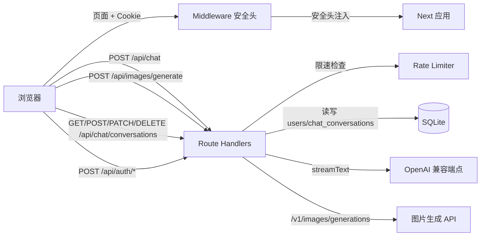

# 架构与方案（与实现对齐）

## 技术栈

- **Next.js 15.2.8**（App Router。15.2.x 在 [安全更新](https://nextjs.org/blog/security-update-2025-12-11) 建议版本线内，含 CVE-2025-55184/55183 等修复，以实际 `package-lock.json` 为准）。
- **React 19**、**TypeScript**、**Tailwind CSS v4**。
- **Vercel AI SDK 6**（`streamText`、`convertToModelMessages`、`@ai-sdk/react` 的 `useChat`、`@ai-sdk/openai` 的 `createOpenAI`）。
- **SQLite**（`better-sqlite3`）存储用户与密码哈希；**jose** 签发/校验 **JWT**；**bcryptjs** 哈希密码；**Zod 4** 校验请求体。

## 逻辑结构

## 重要路径

- **会话**：`itip_session` Cookie（HttpOnly）；`lib/auth/session.ts`。
- **对话**：`app/api/chat/route.ts` 内 `getSession()` 失败则 401；成功则 `streamText`：`system` 为 `CALLIGRAPHY_SYSTEM`，`messages` 为 **`CALLIGRAPHY_FEW_SHOT_MESSAGES`（few-shot）** 与前段经 `convertToModelMessages` 后的内容拼接，再 `toUIMessageStreamResponse()`。
- **前端对话**：`components/CalligraphyChat.tsx` 使用 `DefaultChatTransport` + `useChat`。
- **图片上传**：对话中通过 `<input type="file">` 上传图片，经 AI SDK 的 `sendMessage({ files })` 发送至支持视觉的模型（如 `glm-4-flash`）。
- **图片生成**：`app/api/images/generate/route.ts` 调用 OpenAI 兼容 `/v1/images/generations` 端点。
  - 模型由 `AI_IMAGE_MODEL` 环境变量控制，默认智谱 `cogview-3-flash`，其他供应商默认 `dall-e-3`。
  - 复用 `AI_BASE_URL` + `AI_API_KEY` 的对话配置。
  - UI：聊天输入区「星光」按钮 → 弹出面板输入 prompt → 生成的图片以「墨图」卡片形式展示。
- **多会话管理**：
  - 数据层：`lib/chat-store.ts`
  - API 层：`/api/chat/conversations/route.ts` + `[id]/route.ts`
  - 组件层：`components/ChatShell.tsx` 侧边栏，桌面端自动展开、移动端折叠叠加。

## 安全层

- **Middleware**（`middleware.ts`）：全局安全头（CSP、X-Frame-Options 等）。
- **速率限制**（`lib/rate-limit.ts`）：登录/注册/图片生成均有 IP 级别限速。

## SEO 与 PWA

- `robots.ts`、`sitemap.ts`、`layout.tsx` Open Graph 元数据。
- `public/manifest.json` + `public/icons/`：PWA 安装支持。

## 可访问性

- 表单 `useId` + `role="alert"` + `aria-describedby`。
- 导航 landmark：`role="navigation"`、`role="banner"`、`role="main"`。
- 侧边栏：`aria-current`、`aria-expanded`、`role="menu"`。

## 流式分词（中文）

- `smoothStream({ chunking: new Intl.Segmenter("zh-Hans", { granularity: "word" }) })`。
