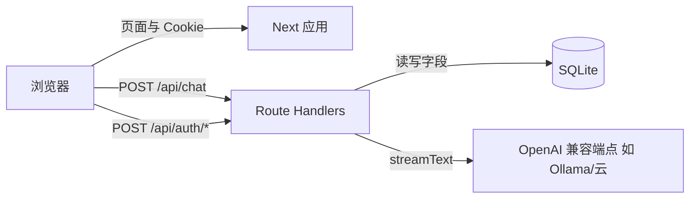

# 架构与方案（与实现对齐）

## 技术栈

- **Next.js 15.2.8**（App Router、15.2.x 在 [安全更新](https://nextjs.org/blog/security-update-2025-12-11) 建议版本线内，含 CVE-2025-55184/55183 等修复，以实际 `package-lock.json` 为准）。
- **React 19**、**TypeScript**、**Tailwind CSS v4**。
- **Vercel AI SDK 6**（`streamText`、`convertToModelMessages`、`@ai-sdk/react` 的 `useChat`、`@ai-sdk/openai` 的 `createOpenAI`）；参考 [AI SDK 文档](https://sdk.vercel.ai/docs) 与 [streamText](https://ai-sdk.dev/docs/reference/ai-sdk-core/stream-text)。
- **SQLite**（`better-sqlite3`）存放用户与密码哈希；**jose** 签发/校验 **JWT**；**bcryptjs** 哈希密码；**Zod 4** 校验请求体。

## 逻辑结构

## 重要路径

- **会话**：`itip_session` Cookie（HttpOnly）；`lib/auth/session.ts`。
- **对话**：`app/api/chat/route.ts` 内 `getSession()` 失败则 401；成功则 `streamText` 并 `toUIMessageStreamResponse()`。
- **前端对话**：`components/CalligraphyChat.tsx` 使用 `DefaultChatTransport({ api: "/api/chat", credentials: "include" })` 与 `useChat`（见 [AI SDK UI 与流](https://sdk.vercel.ai/docs/ai-sdk-ui/stream-protocol)）。

## 流式分词（中文）

- `experimental_transform: smoothStream({ chunking: new Intl.Segmenter("zh-Hans", { granularity: "word" }) })` 以改善中文分块展示（与 AI SDK `smoothStream` 一致，见 `streamText` 相关文档中的 transform 说明）。

## 文档参考来源说明

- 本仓库在实现时以 **Next.js 官方文档** 与 **Vercel AI SDK 官方文档** 为准；**Context7 在本机 Cursor 中未作为 MCP 启用**，未使用 Context7 拉取文档。
- 版本与 CVE 以 **联网检索** 与 `npm` 实际解析结果为准，升级时请复查 [Next.js 博客](https://nextjs.org/blog) 与 [npm advisory](https://github.com/advisories)。
