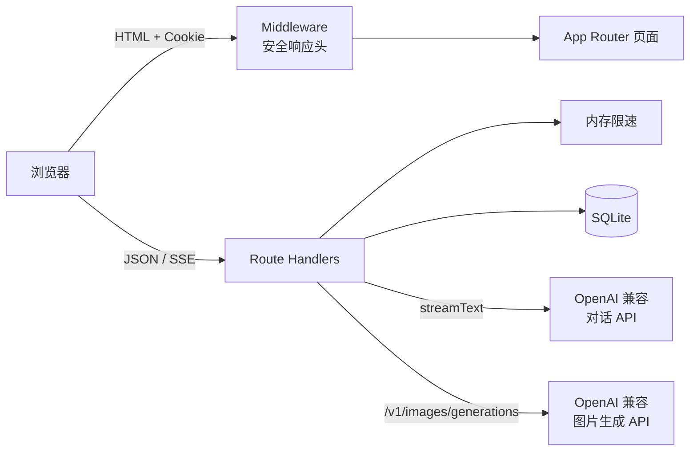

# 架构说明

描述 iTip `web/` 应用的技术架构，与当前源码对齐。

## 目录

- [技术栈](#技术栈)
- [系统概览](#系统概览)
- [目录结构](#目录结构)
- [数据模型](#数据模型)
- [认证与会话](#认证与会话)
- [对话流程](#对话流程)
- [API 参考](#api-参考)
- [前端组件](#前端组件)
- [安全](#安全)
- [SEO 与 PWA](#seo-与-pwa)

## 技术栈

| 类别 | 技术 | 备注 |
|------|------|------|
| 框架 | Next.js **15.2.8+** | App Router；`output: "standalone"` |
| UI | React **19**、Tailwind CSS **v4** | |
| 语言 | TypeScript **5** | |
| AI | Vercel AI SDK **6** | `streamText`、`useChat`、`createOpenAI` |
| 数据库 | SQLite（`better-sqlite3` **12**） | 默认 `web/data/itip.db` |
| 鉴权 | JWT（`jose`）、bcrypt（`bcryptjs`） | Cookie `itip_session` |
| 校验 | Zod **4** | 请求体校验 |

精确版本见 `web/package-lock.json`。Next.js 安全版本线参见 [官方安全公告](https://nextjs.org/blog/security-update-2025-12-11)。

## 系统概览



**设计原则**

- 页面路由与 API 分离；受保护 API 在 Handler 内调用 `getSession()`，401 拒绝
- Middleware **不**做登录拦截，仅注入安全头
- 对话流式响应经 Vercel AI SDK 转为 UI Message Stream

## 目录结构

```
web/
├── app/
│   ├── api/
│   │   ├── auth/              # register, login, logout, me, password
│   │   ├── chat/              # 流式对话
│   │   │   └── conversations/ # 多会话 CRUD
│   │   └── images/generate/   # 图片生成
│   ├── chat/                  # 对话页（需登录）
│   ├── login/、register/、settings/
│   ├── page.tsx               # 首页
│   ├── layout.tsx、globals.css
│   ├── loading.tsx、error.tsx、not-found.tsx
│   ├── robots.ts、sitemap.ts
│   ├── icon.jpg、apple-icon.jpg   # Next.js 元数据图标（file convention）
│   └── chat/loading.tsx、chat/layout.tsx
├── components/                # 客户端 UI
├── lib/
│   ├── ai/config.ts           # AI_* 环境变量解析
│   ├── ai/prompts.ts          # system prompt + few-shot
│   ├── auth/session.ts        # JWT 签发 / 校验
│   ├── chat-store.ts          # 会话持久化
│   ├── db.ts                  # SQLite 初始化
│   └── rate-limit.ts          # 内存限速
├── public/
│   ├── favicon.jpg、favicon.ico   # 浏览器 favicon
│   ├── manifest.json              # PWA manifest
│   └── icons/                     # PWA / Apple Touch（JPEG）
├── middleware.ts
├── next.config.ts
└── .env.example
```

## 数据模型

数据库由 `web/lib/db.ts` 在首次访问时初始化。

### `users`

| 列 | 类型 | 说明 |
|----|------|------|
| `id` | TEXT PK | UUID |
| `email` | TEXT UNIQUE | 登录邮箱 |
| `password_hash` | TEXT | bcrypt 哈希 |
| `created_at` | INTEGER | Unix 毫秒时间戳 |

### `chat_conversations`

| 列 | 类型 | 说明 |
|----|------|------|
| `id` | TEXT PK | UUID |
| `user_id` | TEXT FK | 关联 `users(id)`，级联删除 |
| `title` | TEXT | 对话标题；空时从首条用户消息推导 |
| `messages_json` | TEXT | `UIMessage[]` JSON 序列化 |
| `pinned` | INTEGER | 0 / 1，置顶标记 |
| `created_at` | INTEGER | 创建时间 |
| `updated_at` | INTEGER | 最后更新时间 |

索引：`idx_chat_conversations_user_updated (user_id, updated_at DESC)`。

## 认证与会话

| 项目 | 实现 |
|------|------|
| Cookie 名 | `itip_session` |
| 格式 | JWT（HS256，`jose`） |
| 有效期 | 7 天 |
| 生产环境 | `secure: true`（`NODE_ENV=production`） |
| 密钥 | 环境变量 `AUTH_SECRET`（≥ 16 字符） |
| 密码 | bcrypt，cost factor 10 |

受保护页面（如 `/chat`、`/settings`）在 Server Component 中调用 `getSession()`，未登录则 `redirect("/login")`。

## 对话流程

1. 用户访问 `/chat?c=<id>`；`app/chat/page.tsx` 解析会话 ID，不存在则创建或跳转最近会话
2. `ChatShell` 渲染侧栏 + `CalligraphyChat`
3. 用户发送消息 → `POST /api/chat`（携带 Cookie）
4. 服务端：`getSession()` → `resolveLlmConnection()` → `streamText`：
   - `system`: `CALLIGRAPHY_SYSTEM`
   - `messages`: `CALLIGRAPHY_FEW_SHOT_MESSAGES` + 客户端消息（经 `convertToModelMessages`）
   - `experimental_transform`: 中文 `smoothStream` 分词
5. 响应经 `toUIMessageStreamResponse()` 流式返回
6. 客户端 debounce 450ms 后 `PATCH /api/chat/conversations/[id]` 持久化 `messages`

## API 参考

除注明外，受保护端点需有效 `itip_session` Cookie。

### 认证 ` /api/auth/*`

| 方法 | 路径 | 鉴权 | 说明 |
|------|------|------|------|
| POST | `/api/auth/register` | 否 | 注册；body: `{ email, password }`（密码 ≥ 8） |
| POST | `/api/auth/login` | 否 | 登录；写入 JWT Cookie |
| POST | `/api/auth/logout` | 否 | 清除 Cookie |
| GET | `/api/auth/me` | 可选 | `{ user: { id, email } \| null }` |
| PUT | `/api/auth/password` | 是 | 改密；body: `{ currentPassword, newPassword }` |

### 对话 `/api/chat`

| 方法 | 路径 | 鉴权 | 说明 |
|------|------|------|------|
| POST | `/api/chat` | 是 | 流式对话；未配置 LLM 时 **503** |

### 多会话 `/api/chat/conversations`

| 方法 | 路径 | 鉴权 | 说明 |
|------|------|------|------|
| GET | `/api/chat/conversations` | 是 | 列表；置顶优先，按 `updated_at` 降序 |
| POST | `/api/chat/conversations` | 是 | 新建空会话；返回 `{ id }` |
| GET | `/api/chat/conversations/[id]` | 是 | 读取 `{ id, title, messages }` |
| PATCH | `/api/chat/conversations/[id]` | 是 | 三选一：`{ messages }` 保存消息 / `{ title }` 重命名 / `{ pinned }` 置顶 |
| DELETE | `/api/chat/conversations/[id]` | 是 | 删除会话 |

### 图片 `/api/images/generate`

| 方法 | 路径 | 鉴权 | 说明 |
|------|------|------|------|
| POST | `/api/images/generate` | 是 | body: `{ prompt, size? }`；size 默认 `1024x1024`；返回 `{ url, model, size }` |

## 前端组件

| 组件 | 文件 | 职责 |
|------|------|------|
| `ChatShell` | `components/ChatShell.tsx` | 侧栏（搜索、新建、置顶、重命名、删除）+ 主区域 |
| `CalligraphyChat` | `components/CalligraphyChat.tsx` | 流式聊天、Markdown、附图、图片生成、消息工具栏 |
| `LoginForm` | `components/LoginForm.tsx` | 登录表单 |
| `RegisterForm` | `components/RegisterForm.tsx` | 注册表单 |
| `SettingsForm` | `components/SettingsForm.tsx` | 修改密码 |
| `LogoutButton` | `components/LogoutButton.tsx` | 退出登录 |
| `InkCursor` | `components/InkCursor.tsx` | 首页墨滴光标效果 |
| `SealAvatar` | `components/SealAvatar.tsx` | 印章风格头像（含 `MessageAvatar`） |

## 安全

### Middleware（`web/middleware.ts`）

为页面请求注入：

- `Content-Security-Policy`
- `X-Content-Type-Options: nosniff`
- `X-Frame-Options: DENY`
- `X-XSS-Protection`
- `Referrer-Policy`
- `Permissions-Policy`

`matcher` 排除 `api`、静态资源、`favicon.ico`、`favicon.jpg`、`icons/`、`manifest.json`、`robots.txt`、`sitemap.xml`。

### 速率限制（`web/lib/rate-limit.ts`）

内存 Map 实现，适合单机部署：

| 端点 | 限制 |
|------|------|
| 登录 | 10 次 / IP / 分钟；5 次 / 邮箱 / 5 分钟 |
| 注册 | 5 次 / IP / 10 分钟 |
| 改密 | 5 次 / IP / 10 分钟 |
| 图片生成 | 10 次 / IP / 10 分钟 |
| 对话 | 无 |

## SEO 与 PWA

| 能力 | 实现 | 备注 |
|------|------|------|
| 元数据 | `app/layout.tsx` | `SITE_URL` 作为 `metadataBase`；图标由 `app/icon.jpg`、`app/apple-icon.jpg` 自动生成 |
| robots | `app/robots.ts` | 禁止 `/api/`、`/chat?`；sitemap URL 当前硬编码为 `https://itip.example.com/sitemap.xml` |
| sitemap | `app/sitemap.ts` | `/`、`/login`、`/register` |
| PWA | `public/manifest.json` | 引用 `/icons/icon-192.jpg`、`icon-512.jpg`；**无 Service Worker** |
| 品牌图标 | `web/app/icon.jpg` 等 | JPEG / ICO 静态资源；详见 [BADGES.md](./BADGES.md) |

生产环境请设置 `SITE_URL` 为真实域名，并视需要修正 `robots.ts` 中的 sitemap 地址。
